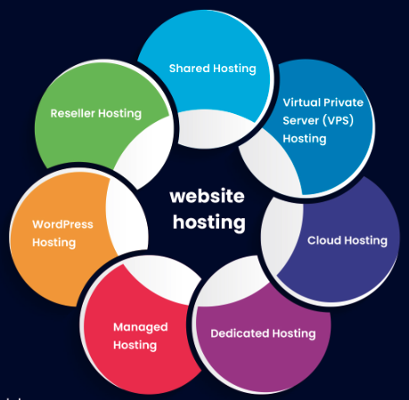

# 1. What is a protocol stack, and how is it used in web development?
## Understanding the Protocol Stack in Web Development

Imagine you're sending a letter to a friend who lives far away. You need to follow certain steps to make sure the letter reaches them correctly. Similarly, when you use the internet and websites, there's a set of steps or rules that need to be followed to ensure that information gets from one place to another. This set of rules is called a **protocol stack**.

A protocol stack for web development is like a recipe that web browsers and servers follow to communicate with each other. It's made up of different layers, each with a specific job. Let's break it down:

  

### Application Layer
This is like the top layer of our recipe. It deals with the actual content of the website, like the text, images, and videos. It's what you see and interact with when you use a website.

### Transport Layer
Imagine this as the middle layer that handles packaging and sending data. It takes the website content from the application layer and divides it into smaller pieces, like breaking down your letter into smaller envelopes.

### Network Layer
This layer is like the post office. It adds addresses to the data packets created by the transport layer so that they can find their way across the internet to the correct destination.

### Link Layer
This is the bottom layer, which is responsible for the physical transmission of data, kind of like the roads and vehicles that carry your letters to the post office.

## How it Works in Web Development

When you type a website address (URL) into your browser and hit Enter, your browser wants to fetch the website's content from a server. Here's how the protocol stack comes into play:

**Browser to Server**: Your browser follows the protocol stack to package your request for the website content. It adds the necessary addresses, just like your friend's address on the envelope.

**Internet Transmission**: The data packets with your request travel through the internet's routers and cables, hopping from one point to another until they reach the server where the website is hosted.

**Server to Browser**: The server receives your request and follows its own protocol stack in reverse. It gathers the website content and sends it back to your browser in packets, using the same layers in the opposite direction.

**Browser Display**: Your browser receives and assembles the data packets, putting together the website's content. This content is then displayed on your screen for you to interact with.

So, a protocol stack is like a set of rules that helps your browser and servers talk to each other and make sure the right information gets to where it needs to go. It's the behind-the-scenes magic that makes web browsing possible!

# 2. What are the different types of web servers, and how do they differ in terms of functionality and performance?

## Types of Web Servers

Imagine a web server as a waiter in a restaurant. Its job is to take your order, bring you the food you requested, and make sure you're happy with your meal. Similarly, a web server's job is to take requests from your computer when you want to see a website, and then it sends back the website's content so you can see it on your screen.

There are a few different types of web servers, each with its own way of doing this job:

### 1. Apache

  

Think of this like a very experienced waiter who can handle lots of customers at once. Apache is known for being reliable and can serve many web pages to lots of people simultaneously. It's like a busy restaurant that can serve a big crowd without making you wait too long.

### 2. Nginx (engine-x)

  

Picture a super-efficient waiter who can take orders and deliver food really quickly. Nginx is known for its speed and ability to handle a lot of requests without using too much computer memory. It's like a high-speed restaurant that gets your food to you in a flash.

### 3. Microsoft IIS

  

Imagine a waiter who's really familiar with a certain type of cuisine. Microsoft IIS is like a server that works best with websites and apps built using Microsoft technologies. It's like a restaurant specialized in a specific type of food, where they're experts at making just that.

### 4. LiteSpeed

  

Think of this like a modern, tech-savvy waiter. LiteSpeed is known for being resource-efficient and can handle a good number of customers. It's like a trendy restaurant that uses the latest cooking techniques to make the most out of their ingredients.

### 5. Node.js

  

Now, picture a waiter who can do more than one thing at a time, like taking your order while also telling the chef how you want your food prepared. Node.js is special because it can handle both serving web pages and doing other tasks at the same time. It's like a multitasking restaurant that can handle various activities at once.

So, in simple terms, these different types of web servers are like waiters with their own unique styles. Some are great at serving lots of people, some are super fast, some specialize in certain things, and some can do more than one thing at a time. The choice of which web server to use depends on how busy your website is and what kind of technology your website is built with.

# 3. What is web hosting, and what are the different types of hosting services available for websites?
## Web Hosting

Imagine you're building a house (which is like your website), and you need a place to put it. Web hosting is like renting land or space on the internet where your website can live so that people can visit and see what you've built.

### Types of Hosting Services

There are different types of hosting services, each offering different levels of space, resources, and features. Here are a few types:

  

- **Shared Hosting**: This is like living in an apartment building. Many websites share the same space on a server (a powerful computer). It's cheaper, but sometimes you might experience slower speeds if your neighbors' websites are busy.

- **VPS Hosting (Virtual Private Server)**: Think of this as having a townhouse. You still share a server with other websites, but you get a more private and separate space. It's better for websites that need more control and resources.

- **Dedicated Hosting**: Imagine having a whole house to yourself. With dedicated hosting, you get an entire server just for your website. It's more expensive, but you get all the resources and control, which is great for big websites.

- **Cloud Hosting**: Cloud hosting is like having a flexible apartment. Your website is hosted on multiple servers in different places, and if one server gets busy or goes down, your site switches to another automatically. It's good for handling traffic spikes.

- **Managed WordPress Hosting**: If you're building your site with WordPress (a popular website-building tool), this is like having a super helpful landlord. They take care of technical stuff like updates and security, so you can focus on your site.

- **Reseller Hosting**: This is like becoming a mini-landlord. You can buy hosting space and resources in bulk, then sell them to other people who want to host their websites. It's for those who want to start a hosting business.

So, web hosting is like finding a place on the internet where your website can live, and the type of hosting you choose is like deciding what kind of place that will be - a shared apartment, a private townhouse, or even your own house!

# 4. What is scaling, and why is it important for web applications? How does scaling differ for vertical and horizontal scaling?
## Scaling for Web Applications

### What is Scaling?

Scaling in the context of web applications is like preparing your online store for a big sale. Imagine you run a small online shop selling clothes. As your shop becomes popular, more and more customers start visiting to buy clothes. Scaling is the process of making sure your shop can handle all these customers without slowing down or crashing, just like having enough staff and space to serve everyone during a busy sale.

### Why Scaling is Important

Web applications, like online shops or social media sites, need to be ready for a lot of visitors all at once. If too many people try to use the website at the same time and it's not set up to handle that load, it can become really slow or even stop working. This could make customers frustrated and leave your website, which is bad for business. Scaling is important to make sure your web application stays fast, reliable, and available to everyone, no matter how many people are using it.

  

### Vertical Scaling

Imagine you have a computer that you use to play games. If you want to make it more powerful so it can handle bigger and fancier games, you might upgrade its parts—like adding a faster processor or more memory. Vertical scaling for web applications is similar. It involves making the existing server or computer stronger by giving it more resources, like increasing its memory, CPU power, or storage. It's like giving your computer a supercharge to handle more tasks.

### Horizontal Scaling

Think of horizontal scaling like a pizza place that gets busier and busier. If one person has to make all the pizzas, they might get overwhelmed. But if you hire more pizza makers and more ovens, you can make many pizzas at once. Horizontal scaling for web applications is similar. Instead of boosting one server, you add more servers, like having more pizza ovens. Each server works together and handles a portion of the work. This way, your web app can serve lots of people simultaneously.

In a nutshell, scaling for web applications is about making sure your online service can handle lots of users without slowing down. Vertical scaling is like giving your computer a power boost, while horizontal scaling is like adding more computers to share the load. Both ways help your web app stay speedy and reliable, even when many people want to use it at the same time. The choice between vertical and horizontal scaling depends on how you want to grow and how much traffic your app gets.

# 5. What is SEO (Search Engine Optimization), and how can web developers optimize their websites for better search engine rankings?
## SEO (Search Engine Optimization)

Search Engine Optimization (SEO) is the practice of enhancing a website's visibility on search engine results pages (SERPs) organically, aiming to attract more relevant and valuable organic traffic.

### Types of SEO

  

1. **On-Page SEO:** Focuses on optimizing individual web pages by fine-tuning content, meta tags, and other on-page elements for search engines and users.

2. **Off-Page SEO:** Involves activities that occur outside your website, such as link building and social media engagement, to enhance your site's authority and reputation.

3. **Technical SEO:** Concentrates on optimizing technical aspects of your website, like site speed, mobile-friendliness, and structured data, to improve how search engines crawl, index, and rank your site.

### Subtypes

#### On-Page SEO Subtypes

1. **Content SEO:** Emphasizes the creation of valuable and relevant content tailored to user intent and optimized with appropriate keywords.

2. **Keyword SEO:** Involves thorough keyword research and optimization to target specific search terms that users frequently use.

3. **Multimedia SEO:** Focuses on optimizing images, videos, and other multimedia elements for better search visibility and user experience.

4. **Local SEO:** Aims to enhance a website's visibility in local search results, vital for businesses with physical locations.

#### Off-Page SEO Subtypes

1. **Link Building:** Involves acquiring quality backlinks from authoritative websites to increase your site's credibility and authority.

2. **Social Media SEO:** Leverages social media platforms to increase brand visibility and indirectly influence search rankings through social signals and traffic.

3. **Influencer SEO:** Collaborates with industry influencers to gain exposure, credibility, and potential backlinks.

#### Technical SEO Subtypes

1. **Crawl Optimization:** Focuses on ensuring that search engines can effectively crawl and index your site's content.

2. **Site Speed Optimization:** Enhances loading times for improved user experience and search engine rankings.

3. **Mobile SEO:** Ensures your site is optimized for mobile devices, as mobile-friendliness is a crucial ranking factor.

4. **Structured Data and Schema Markup:** Implements structured data to provide additional context to search engines, resulting in enhanced search results with rich snippets.

5. **Indexation Management:** Strategies to control what parts of your site are indexed by search engines.

### Key Optimization Strategies for Better Rankings

1. **Keyword Research:** Conduct thorough research to identify the keywords and phrases that users commonly search for in relation to your website's content.

2. **On-Page Optimization:** Refine individual web pages by optimizing their elements for search engines and users. This includes incorporating relevant keywords naturally in the content, title tags, meta descriptions, and header tags.

3. **Quality Content:** Develop high-quality, unique, and valuable content that caters to user needs and answers their queries. Well-written content improves user engagement and signals relevance to search engines.

4. **Mobile-Friendly Design:** Ensure your website is responsive and user-friendly across various devices, particularly smartphones and tablets. Google prioritizes mobile-friendly sites in its rankings.

5. **Page Speed Optimization:** Improve the loading speed of your web pages. Faster load times lead to better user experiences and higher search rankings.

6. **URL Structure:** Create descriptive, user-friendly URLs that provide clear indications of the content on the page. Avoid lengthy and complex URLs.

7. **Internal Linking:** Interconnect relevant pages within your website using internal links. This enhances user navigation and helps search engines understand your site's structure.

8. **External Linking:** Link to credible and authoritative external sources. Outbound links signal to search engines that your content is well-researched and connected to reputable information.

9. **Schema Markup:** Implement schema markup, a form of structured data, to provide context to search engines about the content on your pages. This can lead to enhanced search results with rich snippets.

10. **SSL Security:** Secure your website with an SSL certificate to establish a secure connection. Google considers secure websites a positive ranking factor.

11. **User Experience (UX):** Prioritize a smooth and intuitive user experience. Engaging and user-friendly websites tend to have lower bounce rates and longer session durations, which can indirectly impact SEO.

SEO is an ongoing process that requires continuous effort and adaptation to stay aligned with search engine algorithms. Collaboration between web developers, content creators, and SEO specialists is essential to execute a well-rounded SEO strategy that incorporates elements from all types and subtypes. This holistic approach leads to improved search engine rankings, increased organic traffic, and better user experiences.

# References
1. [ChatGPT](https://chat.openai.com/auth/login) AI Tool by OpenAI

2. [How Does the Internet Work?](https://www.cloudflare.com/learning/internet/how-does-the-internet-work/) by Cloudflare

3. [The OSI Model Explained](https://www.cloudflare.com/learning/security/glossary/what-is-the-osi-model/) by Cloudflare

4. [TCP/IP Protocol Suite](https://www.tutorialspoint.com/ipv4/ipv4_quick_guide.htm) on TutorialsPoint

5. [How Browsers Work: Behind the scenes of modern web browsers](https://www.html5rocks.com/en/tutorials/internals/howbrowserswork/) on HTML5 Rocks

6. [Understanding a Web Server and Types of Web Servers](https://www.milesweb.in/blog/hosting/web-server-types-web-servers/) on Miles Web

7. [8 Best Web Servers for Windows and Linux](https://www.elegantthemes.com/blog/wordpress/best-web-servers-for-windows-and-linux?utm_source=Blog&utm_medium=Manual%20WordPress%20Targets&utm_campaign=Google%20Search&retargeting=off&gclid=CjwKCAjwxOymBhAFEiwAnodBLOejHyZm3p5cpjlSi-qb0lrBagSiMqNgP-CT-wjw9SjOjZyv3iOMXhoC9yoQAvD_BwE) on Elegant Themes

8. [What is Web Hosting?](https://www.namecheap.com/hosting/what-is-web-hosting-definition/) on namecheap

9. [The 6 Best Types of Web Hosting to Consider in 2023](https://www.quicksprout.com/types-of-web-hosting/) on Quicksprout

10. [How to Scale Web Application: The Best Techniques](https://softwarehut.com/blog/tech/how-to-scale-web-application#:~:text=Horizontal%20scaling%2C%20also%20known%20as,task%20among%20the%20additional%20nodes.) on Softwarehut

11. [Search Engine Optimization - Learn to Optimize for SEO](https://www.wordstream.com/seo) on Wordstream
