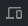

# Chrome DevTools Usage Guide

## Q: Which panel in Chrome DevTools should you use to inspect the DOM and CSS of a webpage?
A: To inspect the DOM and CSS of a webpage, you should use the **Elements** panel in Chrome DevTools.

## Q: Which panel in Chrome DevTools should you use to debug the JavaScript code on a webpage?
A: If you suspect that a JavaScript function is causing errors on a webpage, you can use the **Sources** panel in Chrome DevTools for debugging.

## Q: Which panel in Chrome DevTools should you use to analyze the network requests and responses of a webpage?
A: To analyze network requests and responses of a webpage, including identifying slow-loading requests, use the **Network** panel in Chrome DevTools.

## Q: Which panel in Chrome DevTools should you use to inspect and manipulate browser storage on a webpage?
A: To inspect and manipulate browser storage like cookies and local storage, use the **Application** panel in Chrome DevTools.

## Q: Which panel in Chrome DevTools should you use to analyze the performance of a webpage and identify potential bottlenecks?
A: For performance analysis and identifying bottlenecks, use the **Performance** panel in Chrome DevTools.

## Q: Which panel in Chrome DevTools should you use to analyze the security of a webpage and identify potential vulnerabilities?
A: To test the security of a webpage and identify vulnerabilities, use the **Security** panel in Chrome DevTools.

## Q: Which panel in Chrome DevTools should you use to view and modify the CSS styles of a webpage in real-time?
A: For real-time CSS styling, use the **Elements** panel in Chrome DevTools.

## Q: Which panel in Chrome DevTools should you use to test the responsiveness of a webpage on different screen sizes?
A: To test responsiveness on various screen sizes, use the **Responsive** panel  in Chrome DevTools.
